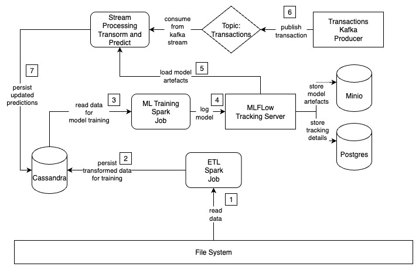

# 🛡️ Credit Card Fraud Detection System

This project is an **end-to-end system** for detecting fraudulent credit card transactions. 
It integrates **data engineering, model training, and experiment tracking** into a production-ready architecture.

  

---
## 📌 Architecture

  

1. **File System** → Stores raw transaction data.  
2. **ETL Spark Job** → Reads raw data, transforms it, and persists it into Cassandra.  
3. **Cassandra** → Acts as the feature store for model training.  
4. **ML Training Spark Job** → Reads training data from Cassandra and trains models.  
5. **MLflow Tracking Server** → Logs trained models and experiment metadata.  
   - **MinIO** → Stores ML models and artifacts.  
   - **Postgres** → Stores MLflow experiment and run metadata.  
6. **Stream Processing Job** -> Consumes new transactions from kafka stream, transform, predict and persist 
7. **Kafka Producer** -> Generates transactions and publishes to topic
---

## 🛠️ Tech Stack
- **Apache Spark** for Batch + Stream processing  
- **Apache Cassandra** as Database and Feature store 
- **Apache Kafka** for Real-time transaction streaming 
- **MLflow** for Experiment tracking & model registry  
- **MinIO** for Artifact storage 
- **Postgres** for Metadata store  
- **Docker Compose** for service orchestration
